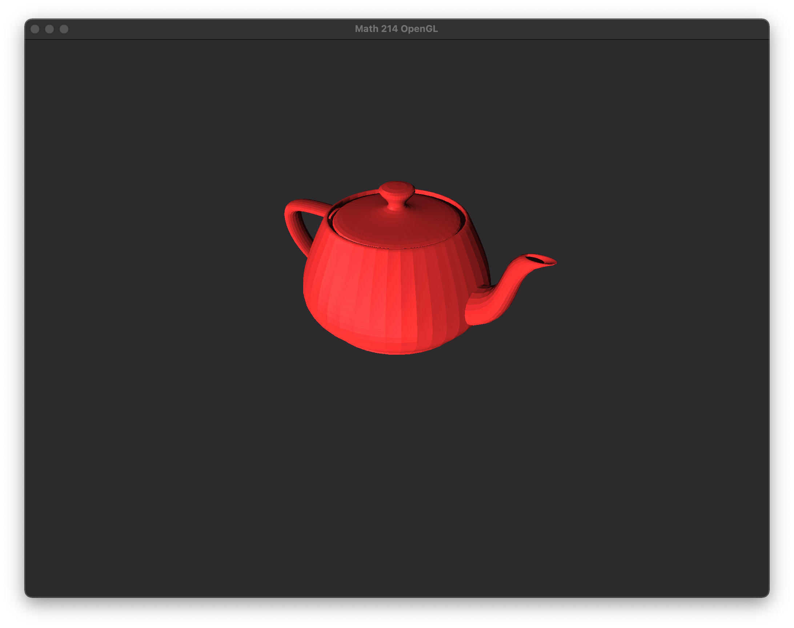

# Math 214 OpenGL Project

## Description
This project was completed for [Math 214: Applied Linear Algebra](http://dept.math.lsa.umich.edu/courses/214/index.html) at the University of Michigan.
The purpose of this project is to investigate computer graphics and linear algebra by rendering and shading the famous [Utah Teapot](https://en.wikipedia.org/wiki/Utah_teapot) through OpenGL.

This project will cover the different spaces OpenGL uses, its Model View Projection (MVP) matrix, camera manipulation, some basic shaders, and the mathematical operations used.

[Project Poster](poster.pdf)

### Contributors & uniqnames
[Jason Liu](https://github.com/JasonLiu2002) (jyliuu)

[Quintin Dwight](https://github.com/qhdwight) (qdwight)

Yu Han Yang (andyyhy)

Joseph Li (junnnli)
